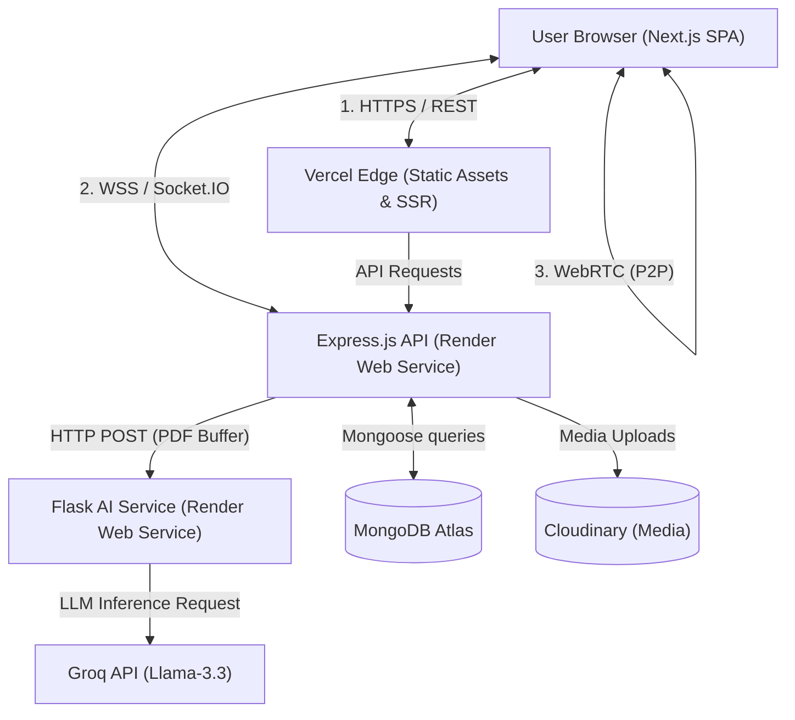
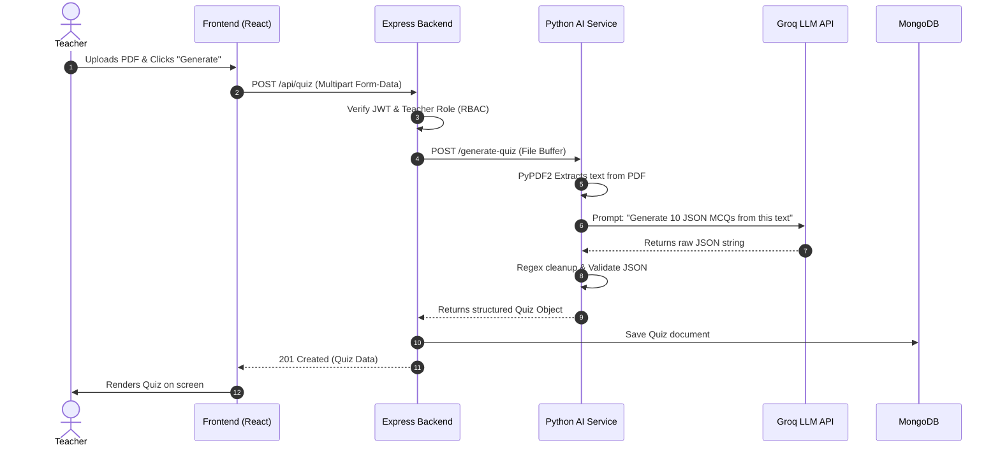
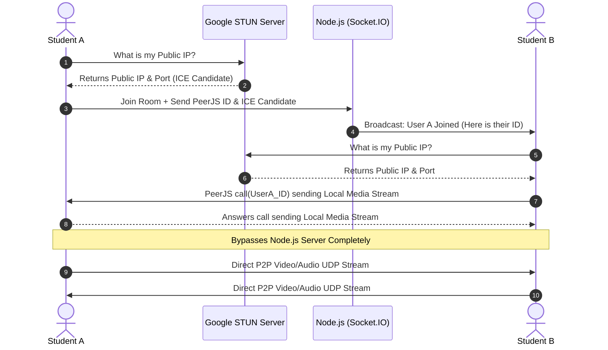
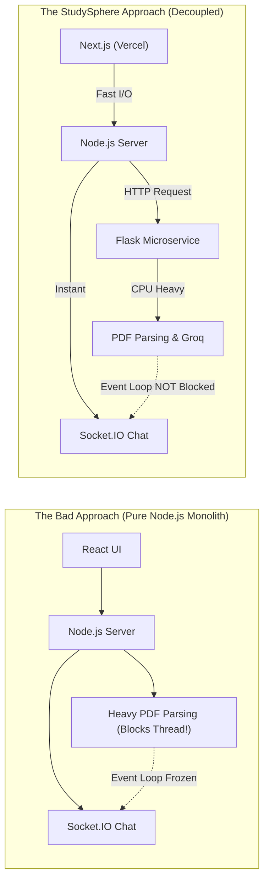
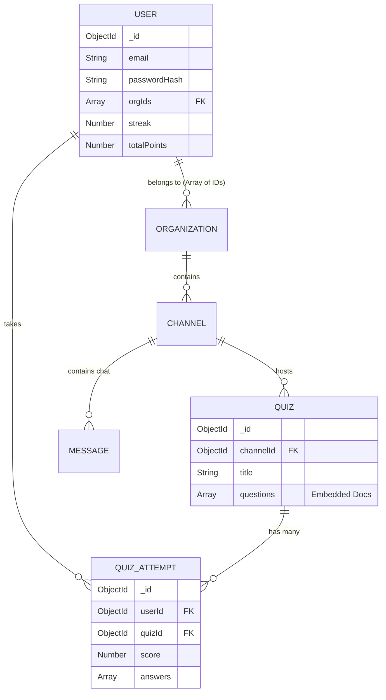
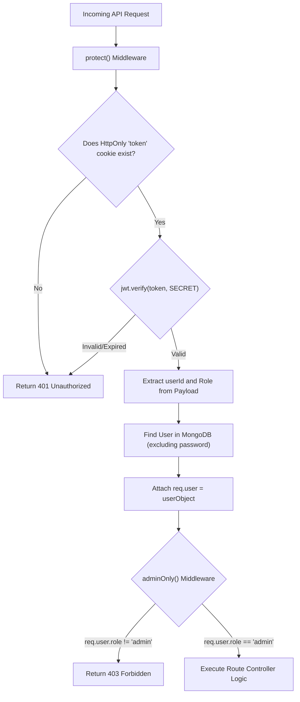

# Architecture Diagrams Cheat Sheet

This document contains the essential diagrams required to master the "Final Checklist Before the Interview". Use these to practice your whiteboard explanations.

---

## 1. System Architecture (The Big Picture)
*Checklist Item: I can draw the System Architecture from memory.*

---

## 2. AI Quiz Generation Flow
*Checklist Item: I can explain the AI Quiz Generation flow step-by-step.*

---

## 3. WebRTC Peer-to-Peer Signaling
*Checklist Item: I know exactly how WebRTC peer-to-peer signaling works in my app.*

---

## 4. Next.js & Flask vs. Monolith
*Checklist Item: I can defend why I used Next.js and Flask instead of a monolith.*

---

## 5. Database Schema & Relationships (ERD)
*Checklist Item: I can explain the database schema and its relationships.*

---

## 6. JWT Authentication & RBAC Implementation
*Checklist Item: I know how JWT authentication and RBAC are implemented.*

