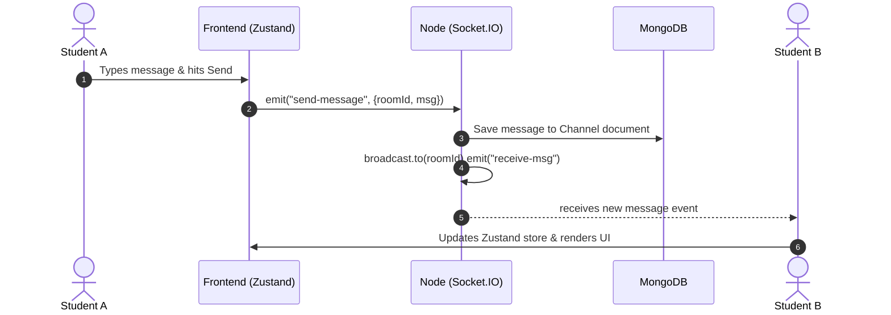
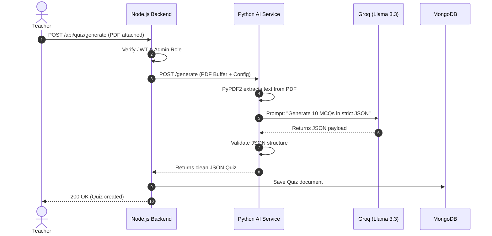

# Chapter 3: Complete System Architecture

To clear a Senior Engineer or System Design interview, you must articulate the "Why" behind your structural decisions. This chapter breaks down the StudySphere architecture from a 10,000-foot view down to the precise flow of data between microservices.

---

## 1. High-Level Architecture (The 10,000-Foot View)

StudySphere employs a **Decoupled Client-Server Architecture** with a hybrid **Microservices approach**.

The system is split into three core layers:
1.  **Presentation Tier (Client):** Next.js (React) application responsible for the UI, state management, and establishing WebRTC/WebSocket connections.
2.  **Application Tier (Node.js/Express):** The primary brain. It acts as an API Gateway, handles Auth (JWT), business logic, Database operations, and WebSocket (Socket.IO) signaling.
3.  **AI Microservice Tier (Flask):** A dedicated Python server isolated purely for CPU-intensive tasks (PDF parsing, LLM prompt engineering via Groq API).

### Diagram: High-Level Architecture
```mermaid
flowchart TD
    Client["Next.js Client Browser"]
    ExpressAPI["Express.js Main Backend"]
    FlaskAI["Flask Python AI Service"]
    MongoDB[("MongoDB Atlas")]
    GroqLLM["Groq Llama-3.3 LLM"]

    Client <-->|REST (Axios) & WSS (Socket.IO)| ExpressAPI
    Client <-->|WebRTC (P2P)| Client
    ExpressAPI <-->|Mongoose queries| MongoDB
    ExpressAPI -->|HTTP POST (Payload)| FlaskAI
    FlaskAI -->|API Request| GroqLLM
```

---

## 2. Low-Level Architecture & Design Patterns

### The Backend: MVC (Model-View-Controller) Pattern
The Express.js backend strictly follows the MVC pattern, adapted for an API-first approach (where the "View" is replaced by JSON responses).

*   **Routes (`/routes`):** Act as the entry point. They map HTTP verbs (GET, POST) to specific controllers.
*   **Controllers (`/controllers`):** The orchestrators. They receive the HTTP Request, extract parameters, call the Service layer, and return the HTTP Response.
*   **Services (`/services`):** The heavy lifters. This is where business logic lives. Controllers should be "thin," and Services should be "thick." Services interact with Models.
*   **Models (`/models`):** Mongoose schemas that define the data structure and handle direct MongoDB interactions.

**Why this pattern? (SOLID Principles)**
This enforces the **Single Responsibility Principle (SRP)**. If the database changes from MongoDB to PostgreSQL, you only rewrite the Models/Services; the Controllers and Routes remain untouched.

### The Frontend: Clean Architecture & Component Design
The Next.js frontend uses the **App Router** for layout-based routing.
*   **Smart vs. Dumb Components:** `OrgMainPage.jsx` is a "Smart" component (fetches data, handles state). `PrimaryBtn.jsx` is a "Dumb" component (only receives props and renders UI).
*   **State Management (Zustand):** Instead of React Context (which causes cascading re-renders), Zustand provides atomic, hook-based global state (`useUserStore`, `useChannelStore`).

---

## 3. End-to-End Data Flow Diagrams

### Scenario A: Real-Time Chat Message Flow


### Scenario B: AI Quiz Generation Flow


---

## 4. Internal Communication Protocols

StudySphere uses three distinct protocols, carefully chosen for their strengths:

1.  **HTTPS (REST API):** Used for standard CRUD operations (Login, Create Org, Fetch Quizzes). It is stateless, cacheable, and secure.
2.  **WSS (WebSockets via Socket.IO):** Used for chat and system notifications (like Leaderboard updates). It maintains a persistent, full-duplex TCP connection, allowing the server to *push* data to the client instantly.
3.  **WebRTC (via PeerJS):** Used for Video and Screen Sharing. It utilizes UDP (User Datagram Protocol) for maximum speed. Node.js only acts as a signaling server to swap IP addresses; after that, media flows directly between browsers, bypassing the server.

---

## 5. Microservices vs. Monolith

### Why a Hybrid Approach?
StudySphere is not a pure microservices architecture (where every single feature is a separate server), nor is it a pure monolith. It is a **Macro-service + Dedicated Microservice** pattern.

*   **The Monolith (Node.js):** Handles Auth, Orgs, Channels, Chat, and DB logic. Breaking this into 5 microservices for an MVP would be "over-engineering," leading to complex distributed transactions and network latency.
*   **The Microservice (Python):** Why extract this? Node.js uses an Event Loop running on a single thread. It is brilliant at handling 10,000 asynchronous network requests (chat messages). However, if you force Node.js to parse a massive PDF and run synchronous CPU-heavy regex on LLM outputs, it **bl ocks the event loop**. During those 3 seconds, no other user can send a chat message. By offloading this to Python/Flask (which is highly optimized for synchronous data processing), Node.js remains unblocked and blazingly fast.

---

## 6. Scalability, Maintainability, & Performance

### Scalability (How to handle 1M users)
1.  **Frontend Scalability:** Next.js deployed on Vercel scales infinitely via Edge CDNs. Static assets (images/CSS) are served from the edge closest to the user.
2.  **Backend Horizontal Scaling:** The Express API is completely stateless (thanks to JWT). This means we can spin up 10 instances of the Node.js server behind an AWS Application Load Balancer.
3.  **WebSocket Scaling limitation:** If User A is connected to Node Server 1, and User B is on Node Server 2, they cannot chat natively. *Solution:* Implement a **Redis Pub/Sub adapter**. When Server 1 receives a message, it publishes it to Redis, which broadcasts it to Server 2.
4.  **Database Scaling:** MongoDB handles read-heavy loads well. We can configure Replica Sets (1 Primary for writes, 2 Secondaries for reads).

### Performance Optimization Techniques Used
*   **Mongoose Indexing:** Lookups by `orgId` or `userId` are indexed to change time complexity from O(N) to O(1).
*   **JWT in HTTP-Only Cookies:** Prevents the browser from needing to attach headers manually via JS, and secures against XSS.
*   **Zustand Selector Optimization:** UI components only subscribe to the specific slice of state they need, preventing unnecessary React re-renders during high-frequency events (like drawing on the whiteboard).

---

## 7. Tradeoffs & Alternatives Considered

**1. MongoDB (NoSQL) vs. PostgreSQL (SQL)**
*   *Alternative:* PostgreSQL.
*   *Why we chose MongoDB:* The schema for a "Quiz" generated by an AI is highly volatile. The number of options, the length of explanations, and the structure can vary. MongoDB’s BSON document structure is perfect for storing highly nested, dynamic JSON objects without requiring complex `JOIN` tables.
*   *Tradeoff:* We lose strict ACID transactional guarantees across multiple documents (though MongoDB now supports them, they are slower).

**2. WebRTC Mesh vs. SFU (Selective Forwarding Unit)**
*   *Alternative:* mediasoup (SFU).
*   *Why we chose Mesh (PeerJS):* Extremely easy to implement, zero server bandwidth cost, perfect for 1-on-1 tutoring or small groups (up to 5 people).
*   *Tradeoff:* CPU and bandwidth scale exponentially. In a 10-person room, each user is uploading 9 video streams and downloading 9 streams. An SFU would be required for large-scale lectures.

**3. Zustand vs. Redux Toolkit**
*   *Alternative:* Redux.
*   *Why we chose Zustand:* Minimal boilerplate. We didn't need time-travel debugging or complex thunks.
*   *Tradeoff:* Less opinionated architecture; if not careful, developers can write messy, unstructured stores.

---

## 8. Complete Folder & Module Responsibilities

### Backend Modules (`backend/`)
*   `controllers/quizController.js`: Extracts req.body, calls `quizService`.
*   `services/quizService.js`: Calculates scores, updates `QuizAttempt`, calculates user streaks.
*   `models/Quiz.js`: Mongoose Schema defining `{ questions: [ { title, options, correctIndex } ] }`.
*   `middlewares/protect.js`: Intercepts route, reads JWT cookie, verifies via `jsonwebtoken`, attaches `req.user`.

### Frontend Modules (`frontend/`)
*   `app/(dashboard)/layout.js`: The persistent UI wrapper (Sidebar, Header) that doesn't re-render when switching pages.
*   `components/meet/Room.jsx`: Heavy component managing `useRef` for local video, and PeerJS event listeners for incoming streams.
*   `store/activeOrgChannel.js`: Zustand store holding the currently selected Organization and Channel ID, preventing the need to pass these IDs down 5 levels of props.

---

## 9. Interview Master Questions (Architecture Focused)

### Q1. Walk me through the architecture of StudySphere.
**Answer:** "StudySphere is a decoupled, hybrid microservice application. The frontend is a Next.js App Router SPA, interacting via REST and WebSockets. The main backend is a Node.js/Express monolithic API Gateway that handles business logic, JWT authentication, and MongoDB interactions. Because AI text processing is CPU-heavy, I extracted that specific domain into a Python/Flask microservice. This ensures the Node.js event loop remains unblocked, maintaining sub-millisecond latency for Socket.IO chat and WebRTC signaling, while the Flask server securely handles PDF extraction and Groq LLM API communication."

### Q2. How do you manage database transactions when a user completes a quiz? What if the score saves, but the leaderboard update fails?
**Answer:** "In a distributed system, this is a classic data-consistency problem. Since we use MongoDB, which supports Multi-Document ACID Transactions (from version 4.0+), I would wrap the Quiz submission inside a Mongoose `session.withTransaction()`. This ensures that updating the `QuizAttempt` document and updating the `User.streak` and `Organization.leaderboard` happen atomically. If the leaderboard update fails, the entire transaction rolls back, preventing inconsistent data states."

### Q3. Why did you use Next.js instead of just a React SPA? Does it help with performance here?
**Answer:** "Next.js provides Server-Side Rendering (SSR). For routes like the landing page or public organization invites, SSR provides excellent SEO and faster First Contentful Paint (FCP). However, for highly interactive dashboards (like the WebRTC video room or Whiteboard), the components are marked with `'use client'` and behave exactly like a React SPA. The main benefit is the file-based routing architecture (App Router) which drastically simplifies organizing nested routes compared to React Router."

### Q4. Tell me about a tradeoff you made in your system design.
**Answer:** "A major tradeoff was choosing a Mesh WebRTC topology using PeerJS instead of implementing an SFU (Selective Forwarding Unit) media server. I chose Mesh because it bypasses the server entirely, meaning my server bandwidth costs for video streaming are literally zero, which is perfect for an MVP. The tradeoff is client-side scalability. Because it's O(N^2) connections, a room with 20 people will likely freeze a standard laptop. If I were designing this for an enterprise lecture hall, I would have traded higher server costs for client stability by building an SFU."

### Q5. Explain how your Python microservice communicates with Node.js.
**Answer:** "It communicates via standard HTTP REST over the internal network. When an Admin requests a quiz, Node.js receives the PDF, validates the user's JWT, and then makes an internal `axios.post` request to the Flask server, passing the file buffer. Node.js `await`s the response. Flask processes the data, calls the LLM, and returns JSON. Since they are separate processes (and in production, separate Docker containers), a failure in the Python script won't crash the Node server; Node will simply catch the error and return a 500 status to the client."

### Q6. How do you secure the internal communication between Node.js and Flask?
**Answer:** "Since Flask shouldn't be exposed to the public internet, in a production environment (like AWS), both servers would be placed in the same Virtual Private Cloud (VPC). The Flask server would only accept traffic originating from the Node.js server's internal IP address. Additionally, we can pass a shared, rotating secret key (API Key) in the headers from Node to Flask to ensure the request is authorized."

### Q7. Why did you choose Zustand over Redux for state management?
**Answer:** "Redux is incredibly powerful but suffers from massive boilerplate—actions, reducers, dispatchers, and thunks. For StudySphere, where the most complex state is managing the 'Active Channel' and WebRTC peer lists, Redux was overkill. Zustand provides a hook-based approach that is un-opinionated and extremely fast. More importantly, Zustand handles transient updates well, which is critical for things like Whiteboard coordinates, where updating a Redux store 60 times a second would cause performance issues."

### Q8. What happens to Socket.IO connections if you scale Node.js horizontally to 5 instances?
**Answer:** "By default, Socket.IO relies on sticky sessions or in-memory tracking. If User A connects to Server 1 and User B to Server 2, Server 1 doesn't know User B exists. To solve this, I would implement the **Socket.IO Redis Adapter**. Redis acts as a Pub/Sub message broker. When User A sends a message, Server 1 publishes it to Redis. Server 2 is subscribed to Redis, receives the message, and pushes it to User B. This allows infinite horizontal scaling of the WebSocket servers."

### Q9. How did you design your Mongoose Schemas to handle relationships?
**Answer:** "I heavily utilized document references (`ref`). For example, the `User` schema doesn't store the entire Organization object; it stores an array of `orgIds`. The `Channel` schema contains an `orgId` reference. When a user loads a dashboard, I use Mongoose's `.populate()` method to resolve these IDs into full objects. This normalized approach prevents data duplication and keeps documents well under MongoDB's 16MB size limit."

### Q10. What is the execution flow when the LLM takes too long and the HTTP request times out?
**Answer:** "LLM generation can take 10-20 seconds, which risks hitting browser or server HTTP timeouts. Currently, the architecture holds the connection open, which is acceptable for an MVP. However, the *ideal* architectural fix is to implement an **Asynchronous Worker Queue** (like RabbitMQ or BullMQ). Node.js would accept the PDF, place a job in the queue, and return a `202 Accepted` to the client. A worker processes the queue, calls Flask, and upon completion, Node.js emits a Socket.IO event to the client saying 'Quiz Ready!', totally avoiding HTTP timeouts."

### Q11. Explain your application's security architecture.
**Answer:** "Security is layered. 
1. **Network:** HTTPS encrypts all transit data. 
2. **Auth:** JWTs are stored in `HttpOnly` cookies, making them invisible to JavaScript (preventing XSS), and we use SameSite policies to prevent CSRF. 
3. **App Logic:** A custom `protect` middleware runs on every API route to verify the JWT signature. We also have Role-Based Access Control (RBAC) middleware verifying if the decoded `req.user.role` matches the required permission for a route.
4. **Database:** Passwords are never stored in plain text; they are salted and hashed using `bcrypt`."

### Q12. How do you handle file uploads for avatars and PDFs?
**Answer:** "I avoided saving files directly to the server's file system, as that breaks the stateless nature of modern cloud deployments (if the server restarts, files are lost). Instead, the Express server accepts the `multipart/form-data` using a middleware like `multer`, processes it into a buffer, and streams it directly to **Cloudinary** (an external blob storage/CDN). The server then saves the returned Cloudinary secure URL into the MongoDB document."

### Q13. Why did you use REST for the API instead of GraphQL?
**Answer:** "REST is the industry standard, highly cacheable, and easier to implement for an MVP. While GraphQL is excellent at solving over-fetching (e.g., requesting a user and only getting their name instead of their whole profile), StudySphere's current data fetching requirements are relatively straightforward. The overhead of setting up GraphQL schemas and resolvers on the backend didn't justify the performance benefits for this specific iteration, though it would be a strong candidate for a V2 refactor."

### Q14. What are the SOLID principles, and how did you apply them?
**Answer:** "The most prominent is the **Single Responsibility Principle (SRP)**. By separating my backend into Routes, Controllers, and Services, each file has one reason to change. The Controller only cares about HTTP (req, res). The Service only cares about business logic. If I switch from Express to Fastify, I only change the Controllers. If I switch from MongoDB to Postgres, I only change the Services/Models. This makes the codebase highly maintainable."

### Q15. How did you optimize the Next.js frontend for performance?
**Answer:** "Several ways:
1. **Code Splitting & Lazy Loading:** Using Next.js dynamic imports (`next/dynamic`) for heavy components like the Whiteboard or Video Player, so they aren't loaded until the user navigates to those specific tabs.
2. **Image Optimization:** Using the Next.js `<Image />` component, which automatically serves WebP formats, prevents layout shifts, and lazy-loads images (like user avatars) only when they enter the viewport.
3. **Avoiding Prop Drilling:** Using Zustand ensures that state updates only trigger re-renders in the specific components listening to that state, rather than re-rendering the entire DOM tree."
