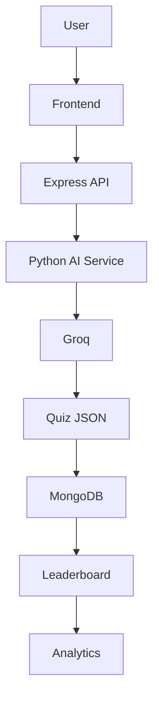
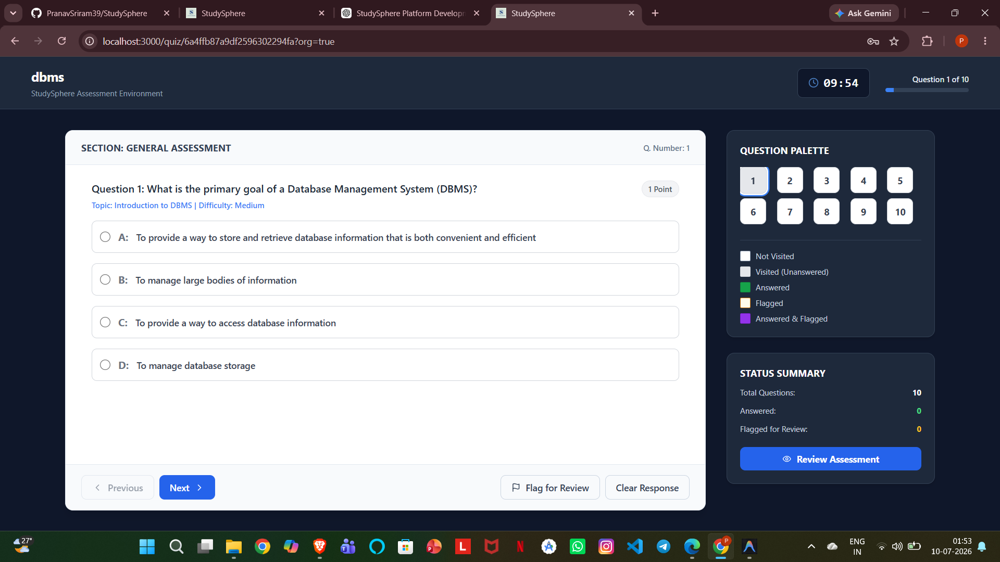

<div align="center">
  
  
  <h1>StudySphere</h1>
  <p><b>Next-Generation Virtual Group Study & AI Assessment Platform</b></p>

  <p>An enterprise-grade, real-time collaboration environment featuring AI-generated quizzes, WebRTC video calling, shared canvas whiteboards, and robust role-based progress analytics.</p>

  <p>
    <a href="https://studysphere39.vercel.app"></a>
    <a href="https://github.com/PranavSriram39/StudySphere/blob/main/LICENSE"></a>
    
    
  </p>
</div>

---

## 📖 Table of Contents

- [Project Overview](#project-overview)
- [Project Highlights](#project-highlights)
- [Feature Showcase](#feature-showcase)
- [System Workflow](#system-workflow)
- [Architecture](#architecture)
- [Tech Stack](#tech-stack)
- [Folder Structure](#folder-structure)
- [Screenshots & Interface](#screenshots--interface)
- [Local Installation](#local-installation)
- [Core Documentation](#core-documentation)
- [Roadmap](#roadmap)
- [Contributing](#contributing)
- [License](#license)

---

## 🌟 Project Overview

**StudySphere** is a virtual, multi-tenant learning workspace designed to bridge the gap between traditional educational structures and modern remote study platforms. 

Standard remote meeting software lacks built-in tools for tracking academic progress, structuring organization hierarchies, and generating real-time learning assessments. StudySphere solves this by providing structured workspace hierarchies, real-time peer-to-peer screen/video interaction, shared whiteboard collaboration, and an automated AI-driven quiz generator engine to test students instantly.

---

## 🚀 Project Highlights

- **🤖 AI-powered quiz generation:** Convert PDFs into quizzes instantly using Llama-3.3.
- **📝 Assessments:** Professional exam environments.
- **🤝 Real-time collaboration:** Chat and collaborate instantly.
- **🎥 WebRTC meetings:** Peer-to-peer video calls and screen sharing.
- **🔐 Role-based access:** Strict access control for admins, teachers, and students.
- **📊 Progress analytics:** Track academic performance over time.
- **🏆 Gamified leaderboards:** Ignite competitive spirits with streaks and badges.
- **🏢 Multi-tenant organizations:** Structured hierarchies and channels.

---

## ✨ Feature Showcase

### Authentication
- Secure JWT stateless sessions.
- Comprehensive Role-Based Access Control (RBAC).

### Organizations
- Multi-tenant structured environments.
- Unique code-matching invites.

### Channels
- Subject-specific boards.
- Granular administrator controls.

### AI Quiz Generation
- PDF Parser Extractor.
- Groq Llama-3.3 pipeline for strict JSON MCQ specifications.

### Assessments
- Professional assessment dashboard.
- Live timed environment with flag-for-review capabilities.

### Leaderboards
- Automated scoring engine.
- Gamified streak metrics and badges.

### Progress Reports
- Detailed historical performance tracking.
- Subject-wise accuracy metrics.

### Profile
- Customizable avatars via Cloudinary.
- Personal bios and skill arrays.

### Chat
- Real-time Socket.IO synchronization.
- Seamless file and media distribution.

### Video Meetings
- One-to-one and group WebRTC rooms.
- Custom PeerJS signaling.

### Screen Sharing
- Direct peer-to-peer screen broadcasting.

### Whiteboard
- Multi-user collaborative HTML5 drawing canvas.

### Analytics
- Deep-dive into time taken, correctness ratio, and overall engagement.

---

## 🔄 System Workflow

The architecture follows a strictly typed, sequential flow from client to AI processor:



---

## 📐 Architecture

StudySphere leverages a multi-tier client-server architecture, highly decoupled for independent scaling.

```mermaid
flowchart TD
    User["Student / Teacher Client"] -->|HTTPS (Axios)| Express["Express.js Server (Port 5000)"]
    User -->|WebSockets| SocketIO["Socket.IO Connection Plane"]
    User -->|WebRTC Media Streams| PeerJS["PeerJS P2P Signaling Node"]
    Express -->|Queries / Updates| DB[("MongoDB Atlas")]
    Express -->|Fetch POST| FlaskAI["Flask AI Service (Port 10000)"]
    FlaskAI -->|API Request| GroqAPI["Groq Llama-3.3 Cloud"]
```

- **Frontend:** Next.js (App Router) provides a lightning-fast, reactive UI managed by Zustand for global states.
- **Backend:** Node.js & Express.js serve as the primary API controller, enforcing RBAC and managing data flow.
- **Python AI Service:** A Flask microservice dedicated solely to PyPDF2 extraction, validation, and Groq SDK interactions.
- **MongoDB:** Mongoose-driven schemas for structured relationships, indexing, and performant reads.
- **Socket.IO:** The real-time connection plane for all chat events and application-wide status sharing.
- **PeerJS / WebRTC:** Direct peer-to-peer signaling nodes for zero-latency video and screen sharing.
- **Groq:** Ultra-fast Llama-3.3 cloud execution for real-time quiz generation.
- **Cloudinary:** Cloud-based asset storage and delivery network for media uploads.

---

## 🛠 Tech Stack

| Layer | Technology |
| :--- | :--- |
| **Frontend** | Next.js 13.5 (App Router), React 18, Tailwind CSS, Zustand |
| **Backend** | Node.js, Express.js |
| **Database** | MongoDB Atlas, Mongoose |
| **Authentication** | JWT (JSON Web Tokens), Cookie-session |
| **Real-time** | Socket.IO, WebRTC, PeerJS |
| **AI Processing** | Python 3.10+, Flask, Groq API (Llama-3.3-70b) |
| **Storage** | Cloudinary |
| **Deployment** | Vercel (Frontend), Render (Backend/AI) |

---

## 📂 Folder Structure

```text
StudySphere/
├── frontend/             # Next.js Application
│   ├── app/              # App Router Pages
│   ├── components/       # Reusable React UI Components
│   └── public/           # Static Assets
├── backend/              # Express.js Server
│   ├── controllers/      # Route Request Handlers
│   ├── models/           # Mongoose DB Schemas
│   ├── routes/           # Express Router Endpoints
│   └── services/         # Business Logic & Helpers
├── py-backend/           # Flask Microservice
│   └── backend.py        # PDF Parser & Groq Integration
└── docs/                 # Core Technical Manuals
```

---

## 🖼 Screenshots & Interface

### 🏠 Landing Dashboard
The welcome interface featuring the platform's core value propositions and direct access to workspaces.


### 🏫 Organization Workspace
The central hub for multi-tenant organizations and nested subject channels.


### 📝 AI Quiz Generation
Show the AI-powered assessment generation page where Organization Creators and Channel Creators can generate quizzes from a topic or uploaded PDF using the integrated AI engine.


### ⏱️ Live Assessment Interface
Real-time quiz taking interface with a dynamic question palette, flagged review system, and timed submission.


### 🏆 Gamified Leaderboard
Real-time organizational rankings tracking scores, accuracy, and daily streaks to ignite competitive learning.


### 👤 Student Profile & Progress
Personalized user profiles highlighting activity history, skill arrays, and overall academic progress.


### 💬 Video Meeting Classroom
WebRTC-powered live collaboration rooms for real-time peer-to-peer study sessions.


### 🖥️ Peer-to-Peer Screen Sharing
Direct screen broadcasting capabilities integrated within the video meeting environment.


### ℹ️ Platform About
Detailed platform information and version details.


---

## 💻 Local Installation

Ensure you have **Node.js (v18+)**, **Python (v3.10+)**, and **MongoDB** installed locally.

### 1. Environment Variables
Before running the services, create local `.env` files in both the frontend and backend directories following the configurations in our [Deployment Guide](docs/deployment.md).

### 2. Run Express Backend
```bash
cd backend
npm install
npm start
```

### 3. Run Python AI Service
```bash
cd py-backend
python -m venv venv
# Windows: .\venv\Scripts\activate
# macOS/Linux: source venv/bin/activate
pip install -r requirements.txt
python backend.py
```

### 4. Run Next.js Frontend
```bash
cd frontend
npm install
npm run dev
```
Navigate to `http://localhost:3000` to interact with the platform.

---

## 📚 Core Documentation

Dive deeper into StudySphere's internal mechanics through our comprehensive technical manuals:

- 📐 **[System Architecture](docs/architecture.md)** — Frontend flow, request lifecycles, and Socket.IO/WebRTC signaling.
- 🌐 **[REST API Specifications](docs/api.md)** — Authentication, organizations, channels, quizzes, and leaderboard routes.
- 💾 **[Database Configuration](docs/database.md)** — Mongoose properties, relations, indexing, and ER diagrams.
- 🛡️ **[RBAC Rules & Guards](docs/rbac.md)** — Permission matrix, quiz attempt restrictions, and security policies.
- ⚙️ **[Deployment Settings](docs/deployment.md)** — Environment variables and Render/Vercel configurations.
- 🔄 **[System Workflows](docs/workflow.md)** — Steps for AI Quiz generation, attempt scoring, and WebRTC handshakes.

---

## 🗺 Roadmap

- [x] **Milestone 1:** Establish organization tenants and invite structures.
- [x] **Milestone 2:** Implement Socket.IO messages syncing and WebRTC screen sharing.
- [x] **Milestone 3:** Deploy Flask backend with Groq pipeline and validation checkers.
- [ ] **Milestone 4:** Calendar integration for scheduling exams and live events.
- [ ] **Milestone 5:** AI-driven study planner and mental health checks page.

---

## 🤝 Contributing

We welcome and appreciate all contributions to StudySphere! To get started:

1. **Fork** this repository.
2. **Create a branch:** `git checkout -b feature/amazing-feature`.
3. **Commit your changes:** `git commit -m 'Add an amazing feature'`.
4. **Push to the branch:** `git push origin feature/amazing-feature`.
5. **Open a Pull Request** for review.

---

## 📄 License

Distributed under the MIT License. See [LICENSE](LICENSE) for more details.

---

<div align="center">
  <b>Built with using  React.js, Next.js, Express.js, MongoDB, Flask, Groq AI, Socket.IO and WebRTC.</b>
</div>
