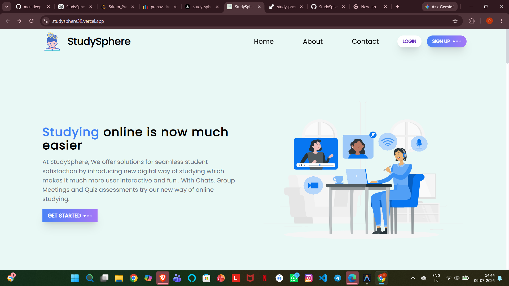
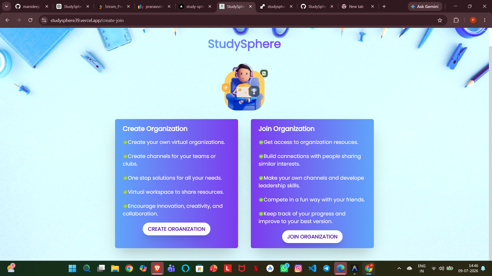
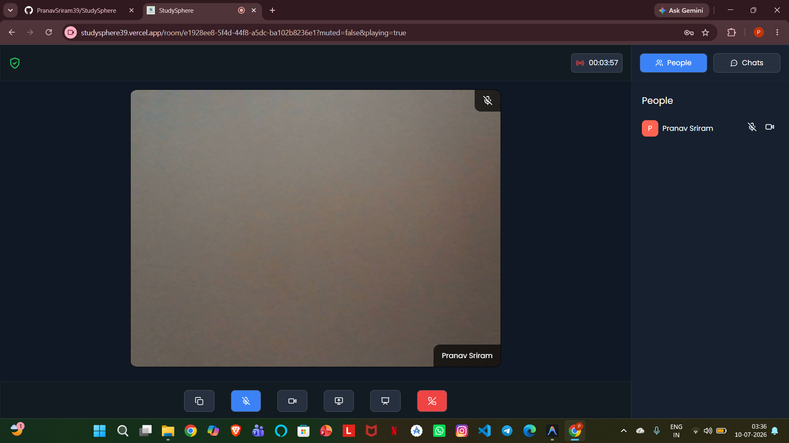
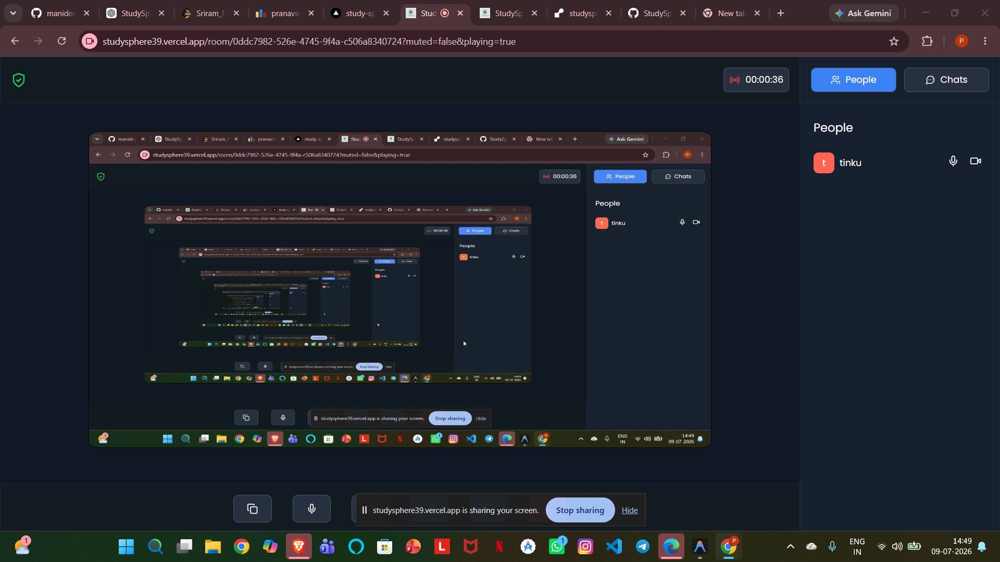
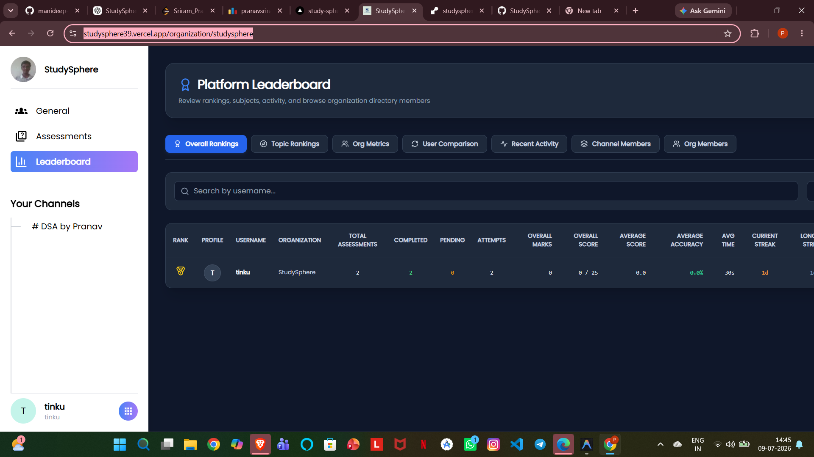
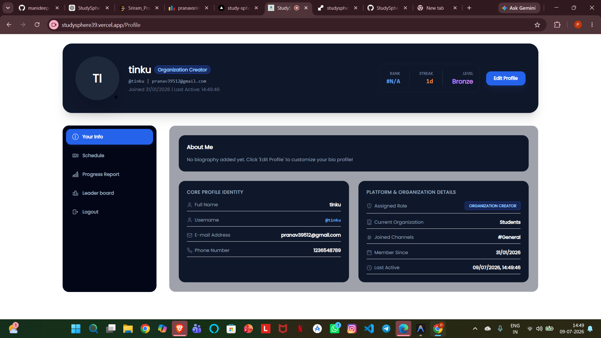
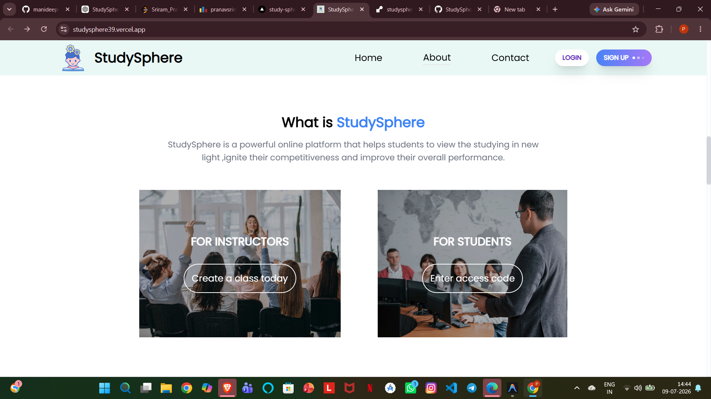

# StudySphere

<div align="center">
  
  
  <h3>Next-Generation Virtual Group Study & AI Assessment Platform</h3>

  <p>An enterprise-grade, real-time collaboration environment featuring AI-generated quizzes, WebRTC video calling, shared canvas whiteboards, and robust role-based progress analytics.</p>

  <p>
    <a href="https://studysphere39.vercel.app"></a>
    <a href="https://github.com/PranavSriram39/StudySphere/blob/main/LICENSE"></a>
    
    
  </p>
  
  <p>
    
    
    
    
    
    
    
  </p>
</div>

---

## 📖 Table of Contents

- [Project Overview](#-project-overview)
- [Key Features](#-key-features)
- [Core Technical Manuals](#-core-technical-manuals)
- [Architecture Summary](#-architecture-summary)
- [Database Schema Outline](#-database-schema-outline)
- [Tech Stack Matrix](#-tech-stack-matrix)
- [Local Installation](#-local-installation)
- [Screenshots & Placeholders](#-screenshots--placeholders)
- [Roadmap](#-roadmap)
- [Contributing](#-contributing)
- [License](#-license)

---

## 🌟 Project Overview

**StudySphere** is a virtual, multi-tenant learning workspace designed to bridge the gap between traditional educational structures and modern remote study platforms. 

### Why StudySphere?
Standard remote meeting software lacks built-in tools for tracking academic progress, structuring organization hierarchies, and generating real-time learning assessments. StudySphere provides structured workspace hierarchies (Organizations and Channels), real-time peer-to-peer screen/video interaction, shared whiteboard collaboration, and an automated AI-driven quiz generator engine to test students instantly.

### Core Problems Solved:
1. **Academic Fragmentation:** Centralizes study groups, files, assessments, leaderboards, and video calls into a single unified workspace.
2. **Manual Quiz Creation Overhead:** Leverages Llama-3.3 LLMs to convert course syllabus PDFs into structured MCQ examinations with zero prep-time.
3. **Engagement Isolation:** Ignites competitive spirits through streak retention features, profile badges, and real-time leaderboard statistics.

---

## ✨ Key Features

StudySphere is split into modular components designed for high-availability performance:

### 🔐 Auth & Governance
* **Secure JWT Sessions:** Stateful cookies handle secure login/session tokens for route authentication.
* **Role-Based Access Control (RBAC):** Strict boundaries between **Organization Admins**, **Channel Admins**, and **Students**.
* **Profile Customization:** Personal bio logs, skill arrays, avatar upload mechanics, and activity analytics.

### 🏫 Workspace Directories
* **Organization Hierarchies:** Multi-tenant code matching invites that allow students to cluster within their organization domain.
* **Subject Channels:** Channel administrators configure distinct topic boards, locking them down or opening access.
* **Real-time Chats:** Streamlined sync chats powered by Socket.IO supporting file upload and media distribution.

### 🎥 Live Collaboration
* **WebRTC Video Rooms:** One-to-one and group video meetings integrated with client microphone, camera, and screen sharing tools.
* **PeerJS Connection Handlers:** Simplified direct signaling channels backed by custom socket rooms.
* **Shared Whiteboard Canvas:** Multi-user collaborative HTML5 drawing board for illustrations during video meets.

### 🤖 AI Assessment Engine
* **PDF Parser Extractor:** Automatic text retrieval from course uploads.
* **Groq Llama-3.3 Pipeline:** Python Flask server feeds prompt vectors to Groq, returning strict-format JSON quiz specifications.
* **Validation & Repair Engine:** Sanitizes double option entries, regenerates corrupt MCQ questions, and enforces index alignment.
* **Leaderboards & Streak Metrics:** Automated scoring engine tracking time taken, correctness ratio, daily streaks, and custom activity badges.

---

## 📚 Core Technical Manuals

We have broken down our core architectures, APIs, and models into detailed specifications:

* 📐 **[System Architecture](file:///c:/Users/prana/StudySphere/docs/architecture.md)** — Explains the Next.js frontend flow, request lifecycles, and Socket.IO/WebRTC signaling.
* 🌐 **[REST API Specifications](file:///c:/Users/prana/StudySphere/docs/api.md)** — Tabular mapping of authentication, organizations, channels, quizzes, and leaderboard routes.
* 💾 **[Database Configuration](file:///c:/Users/prana/StudySphere/docs/database.md)** — Mongoose model properties, relations, indexing, and ER diagrams.
* 🛡️ **[RBAC Rules & Guards](file:///c:/Users/prana/StudySphere/docs/rbac.md)** — Permission matrix, quiz attempt restrictions, and route security policies.
* ⚙️ **[Deployment & Environment Settings](file:///c:/Users/prana/StudySphere/docs/deployment.md)** — Environment variable templates (.env) and Render configuration files.
* 🔄 **[Application Lifecycles](file:///c:/Users/prana/StudySphere/docs/workflow.md)** — Diagram-guided steps for AI Quiz generation, attempt scoring, and WebRTC handshakes.

---

## 📐 Architecture Summary

StudySphere uses a multi-tier client-server architecture. For detailed sequential flows, refer to our **[Architecture Manual](file:///c:/Users/prana/StudySphere/docs/architecture.md)**.

```mermaid
flowchart TD
    User["Student / Teacher Client"] -->|HTTPS (Axios)| Express["Express.js Server (Port 5000)"]
    User -->|WebSockets| SocketIO["Socket.IO Connection Plane"]
    User -->|WebRTC Media Streams| PeerJS["PeerJS P2P Signaling Node"]
    Express -->|Queries / Updates| DB[("MongoDB Atlas")]
    Express -->|Fetch POST| FlaskAI["Flask AI Service (Port 10000)"]
    FlaskAI -->|API Request| GroqAPI["Groq Llama-3.3 Cloud"]
```

---

## 💾 Database Schema Outline

StudySphere uses a structured Mongoose DB layout. Read the **[Database Manual](file:///c:/Users/prana/StudySphere/docs/database.md)** for index properties and pre-save hooks.

* **User (`User`):** Profile details, streaking records, and performance histories.
* **Organizations (`Organizations`):** Unique codes, creator handles, and user listings.
* **Channels (`Channels`):** Subject descriptors, permissions, and members arrays.
* **Chats (`Chats`):** Thread structures and pointers to latest messages.
* **Messages (`Messages`):** Attachment logs, sender objects, and type fields.
* **Quizzes (`Quizzes`):** Question specifications, time ceilings, and creator credentials.
* **QuizAttempt (`QuizUserMap`):** Selected responses, duration records, accuracy, and badge metrics.

---

## 🛠 Tech Stack Matrix

| Layer | Technology | Primary Purpose |
| :--- | :--- | :--- |
| **Frontend** | React, Next.js (v13.5 App Router), Tailwind CSS, Framer Motion, Material UI | UI, styling, animations, dashboard layout. |
| **State Manager** | Zustand | Global client states (auth, active orgs/channels). |
| **Backend API** | Node.js, Express.js | Controller-Service REST APIs, route guards. |
| **AI Server** | Python 3.10+, Flask | PDF extraction (PyPDF2), validation, and Groq SDK integration. |
| **Real-time Sync** | Socket.IO, WebRTC, PeerJS | Chat events, call signaling, status sharing. |
| **Database** | MongoDB Atlas, Mongoose | Schema definitions, collections relations. |
| **Asset Storage** | Cloudinary | Upload handler for avatars and file sharing. |
| **Model Engine** | Llama-3.3-70b-versatile via Groq Cloud | Rapid JSON MCQ generation and question repairs. |

---

## 💻 Local Installation

Ensure you have **Node.js (v18+)**, **Python (v3.10+)**, and **MongoDB** installed locally.

### 1. Setup Environment Variables
Before running the services, create local configuration files according to the **[Deployment Specification](file:///c:/Users/prana/StudySphere/docs/deployment.md)**.

### 2. Launch Express Backend
```bash
cd backend
npm install
node server.js
```

### 3. Launch Flask Python AI Service
```bash
cd py-backend
python -m venv venv
# Windows activate:
.\venv\Scripts\activate
# macOS/Linux activate: source venv/bin/activate
pip install -r requirements.txt
python backend.py
```

### 4. Launch Next.js Frontend
```bash
cd frontend
npm install --force
npm run dev
```
Navigate to `http://localhost:3000` to interact with the platform.

---

## 🖼 Screenshots & Interface

Here is a visual tour of the StudySphere user interface and core features:

### 🏠 Dashboard & Welcome View


### 🏫 Organization & Workspace Directory


### 💬 Active Video Meeting Classroom


### 🖥️ Direct Peer-to-Peer Screen Sharing


### 🏆 Gamified Leaderboard Standings


### 👤 Student Profile & Streak Tracker


### ℹ️ Platform Information Dashboard


---

## 🗺 Roadmap

- [x] **Milestone 1:** Establish organization tenants and invite structures.
- [x] **Milestone 2:** Implement Socket.IO messages syncing and WebRTC screen sharing.
- [x] **Milestone 3:** Deploy Flask backend with Groq pipeline and validation checkers.
- [ ] **Milestone 4:** Calendar integration for scheduling exams and live events (hackathons).
- [ ] **Milestone 5:** AI-driven study planner and mental health checks page.

---

## 🤝 Contributing

We welcome contributions to StudySphere! 

1. **Fork** this repository.
2. Create a new branch: `git checkout -b feature/amazing-feature`.
3. Commit changes: `git commit -m "Add some amazing feature"`.
4. Push to branch: `git push origin feature/amazing-feature`.
5. Open a **Pull Request**.

---

## 📄 License

Distributed under the MIT License. See [LICENSE](file:///c:/Users/prana/StudySphere/LICENSE) for more details.
