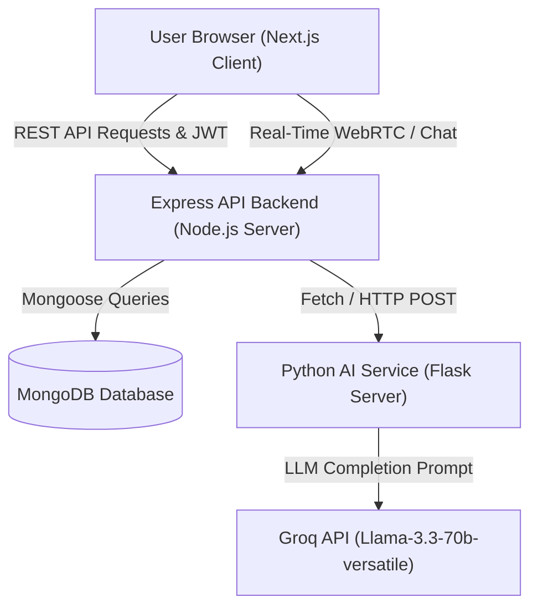
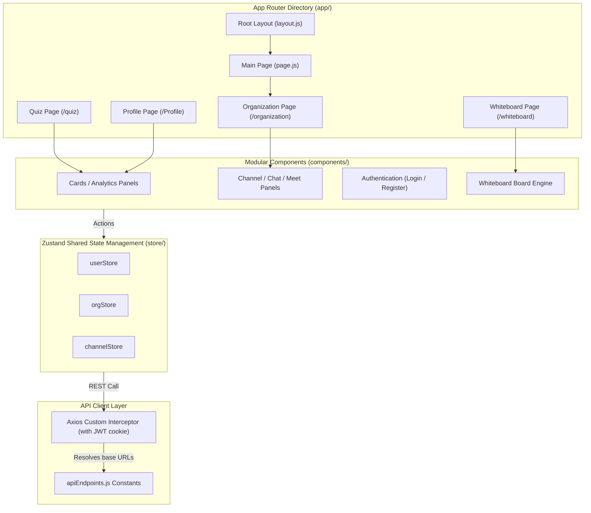
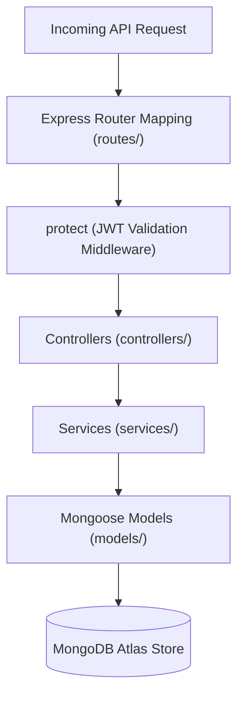
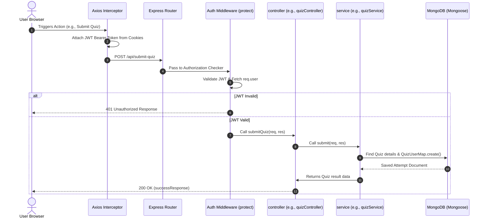
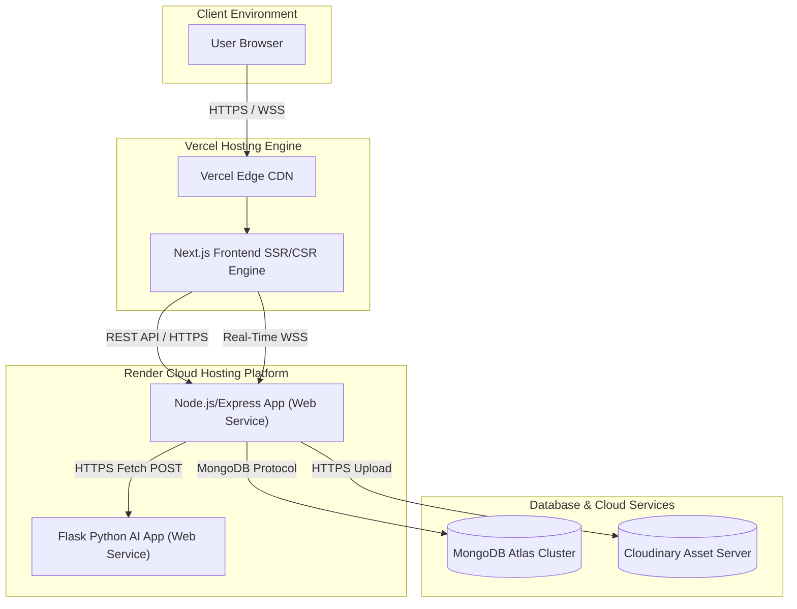

# System Architecture Specification

This document details the system design, components, and communication flows of the StudySphere platform.

---

## 1. High-Level Architecture (Level 1)

This flow illustrates the top-level structural interaction when a student requests services or performs AI-driven activities.



---

## 2. System Architecture Map (Level 2)

StudySphere is divided into three major architectural tiers: the Presentation layer, the Orchestration layer, and the AI/Database layer.

```mermaid
flowchart LR
    subgraph Presentation ["Presentation Layer (Vercel)"]
        NextJS["Next.js App Router Client"]
        Zustand["Zustand State Store"]
        PeerJS_Client["PeerJS WebRTC Handler"]
    end

    subgraph ServiceOrchestration ["Service & Orchestration Layer (Render)"]
        Express["Express.js Server"]
        SocketIO["Socket.IO Server (Real-Time Communication)"]
        AuthMiddleware["JWT Verification & RBAC Middleware"]
    end

    subgraph DataAndAI ["Data & AI Core Services"]
        MongoDB[("MongoDB Atlas")]
        Flask["Flask Python Server (Render)"]
        GroqAPI["Groq LLM Engine"]
        Cloudinary["Cloudinary Storage (Media Attachments)"]
    end

    NextJS -->|Zustand States| Zustand
    NextJS -->|REST API Calls (Axios)| AuthMiddleware
    AuthMiddleware --> Express
    NextJS -->|WebRTC Events| SocketIO
    PeerJS_Client <-->|ICE / P2P Streaming| PeerJS_Client
    SocketIO <--> Express
    Express -->|Query / Updates| MongoDB
    Express -->|Generate Request| Flask
    Express -->|Upload Media| Cloudinary
    Flask -->|Prompt Parser| GroqAPI
```

---

## 3. Frontend Architecture (Level 3)

The frontend is built on **Next.js 13 App Router** with components modularized for scale.



---

## 4. Backend Architecture (Level 4)

The backend follows the **Controller-Service-Model** design pattern to separate concerns.



---

## 5. Folder Architecture (Level 13)

```text
StudySphere/
├── backend/                  # Node.js/Express Backend REST Server
│   ├── config/               # Database Connection Setup
│   ├── controllers/          # Request Handlers & Logic Orchestration
│   ├── helpers/              # Response Structure and Formatter Utilities
│   ├── middlewares/          # JWT Verification & Custom CORS Gateways
│   ├── models/               # MongoDB Mongoose Data Schemas
│   ├── routes/               # Express API Route Mappings
│   ├── services/             # Core Business/DB Operations Logic
│   ├── server.js             # Express & Socket.IO Listener Configuration
│   └── vercel.json           # Vercel Serverless Deployment Config
├── frontend/                 # Next.js Frontend Application
│   ├── app/                  # Next.js 13 App Router Pages and Layouts
│   ├── components/           # Reusable UI Blocks (Quiz, Chats, Video)
│   ├── config/               # Custom Interceptors & Axios Layouts
│   ├── helperFunctions/      # Utility Tools (Formatting, Sorters)
│   ├── lib/                  # Storage abstractions & local adapters
│   ├── public/               # Asset graphics & static images
│   ├── store/                # Zustand State Stores (User, Org, Channel)
│   ├── tailwind.config.js    # Styling Config
│   └── package.json          # Node Modules Dependencies
├── py-backend/               # Flask Python AI Services Engine
│   ├── backend.py            # Flask REST endpoints & Text Processors
│   ├── requirements.txt      # Python Package Manifest
│   ├── test_api.py           # Unit validations & integration tests
│   └── .env                  # Python environment parameters
├── render.yaml               # Deployment Configuration Template (Blueprint)
└── README.md                 # Project Overview Documentation
```

---

## 6. Request Lifecycle (Level 14)



---

## 7. Deployment Architecture (Level 15)



---

## 8. Complete End-to-End System Diagram (Level 16)

This comprehensive overview shows how all modules, protocols, and data layers interconnect.

```mermaid
flowchart TD
    UserClient["Student / Teacher Browser (Next.js Application)"]
    ZustandStore["Zustand Client States (user, org, channel)"]
    PeerJS["PeerJS Host Client (WebRTC Audio/Video Connection)"]

    subgraph CoreBackend ["Express API Server (Node.js)"]
        Router["Express Router (/api)"]
        Middleware["JWT protect & RBAC Checks"]
        Controller["Controllers (User, Org, Quiz, Leaderboard)"]
        Service["Services Layer (Db operations, Streaks, Badges)"]
        SocketServer["Socket.IO Listener (Events: chat, meet, lobby)"]
    end

    subgraph DatabaseLayer ["MongoDB Atlas Cluster"]
        dbUser[("User Collection")]
        dbOrg[("Organization Collection")]
        dbChannel[("Channel Collection")]
        dbQuiz[("Quiz Collection")]
        dbAttempt[("QuizAttempt Collection")]
        dbMessage[("Message Collection")]
    end

    subgraph ExternalServices ["External Resources"]
        FlaskAI["Python Flask Engine (PDF Extractor)"]
        GroqLLM["Groq Llama-3.3 Cloud API"]
        CloudinaryCDN["Cloudinary Media API"]
    end

    UserClient -->|Updates Local State| ZustandStore
    UserClient -->|REST Requests + JWT Cookie| Router
    UserClient -->|Signaling Connection| SocketServer
    UserClient <-->|P2P Media Streams (Screen / Mic / Cam)| PeerJS

    Router --> Middleware
    Middleware --> Controller
    Controller --> Service
    Service -->|Mongoose Schema Updates| dbUser
    Service -->|Mongoose Schema Updates| dbOrg
    Service -->|Mongoose Schema Updates| dbChannel
    Service -->|Mongoose Schema Updates| dbQuiz
    Service -->|Mongoose Schema Updates| dbAttempt
    Service -->|Mongoose Schema Updates| dbMessage

    Service -->|Media Storage Uplink| CloudinaryCDN
    Service -->|AI Generator triggers HTTP request| FlaskAI
    FlaskAI -->|API Calls (llama-3.3-70b-versatile)| GroqLLM
```
