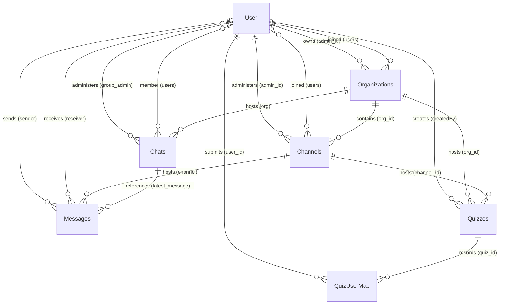

# Database Architecture Spec

This document details the database schema configuration and relationships for the StudySphere platform. StudySphere uses **MongoDB** as its primary persistent store, configured via **Mongoose** Object Data Modeling (ODM).

---

## Entity Relationship (ER) Diagram

---

## Schema Definitions

### 1. User Schema (`User` Model)
Represents registered users, their profile details, and leaderboard/streaks performance metrics.

- **File location:** [userModel.js](file:///c:/Users/prana/StudySphere/backend/models/userModel.js)
- **Timestamps enabled:** Yes (`createdAt`, `updatedAt`)

| Field | Type | Attributes / Default | Description |
| :--- | :--- | :--- | :--- |
| `_id` | `ObjectId` | Primary Key | Auto-generated ID. |
| `name` | `String` | Required | Full name of the user. |
| `username` | `String` | Required, Unique | Unique handle. |
| `email` | `String` | Required, Unique | Contact email. |
| `mobile_number` | `Number` | Required, Unique | Contact number. |
| `password` | `String` | Required | Bcrypt-hashed password string. |
| `image` | `String` | Optional | Profile avatar URL (Cloudinary). |
| `org_joined` | `String` | Optional | Slug/ID of the organization the user is currently in. |
| `bio` | `String` | `""` | User biography description. |
| `phone` | `String` | `""` | Secondary phone string. |
| `linkedin` | `String` | `""` | LinkedIn profile URL. |
| `github` | `String` | `""` | GitHub profile URL. |
| `portfolio` | `String` | `""` | Personal portfolio URL. |
| `skills` | `[String]` | `[]` | Array of skill strings. |
| `lastLogin` | `Date` | Optional | Date of last authentication session. |
| `quizPerformance` | `Subdocument` | - | Performance metrics for leaderboard rendering. |
| `quizPerformance.currentPerformance` | `Number` | `0` | Cumulative score points. |
| `quizPerformance.pastPerformances` | `[Number]` | `[0]` | Array recording historical scores over time (for analytical charts). |
| `currentStreak` | `Number` | `0` | Consecutive days active in doing quizzes. |
| `longestStreak` | `Number` | `0` | Longest consecutive active stretch achieved. |
| `badges` | `[String]` | `[]` | List of earned badge IDs / labels. |
| `token` | `String` | Optional | Active session verification token. |
| `recentActivities` | `Array` | Subdocument | Log of user actions (limit: 15). |

**Hooks:**
- **Pre-save (`save`):** Auto-hashes password using bcrypt if modified. Ensures `pastPerformances` begins with a `0` if not already present.

---

### 2. Organization Schema (`Organizations` Model)
Defines learning institutions or workspaces.

- **File location:** [orgModel.js](file:///c:/Users/prana/StudySphere/backend/models/orgModel.js)
- **Timestamps enabled:** Yes (`createdAt`, `updatedAt`)

| Field | Type | Attributes / Default | Description |
| :--- | :--- | :--- | :--- |
| `_id` | `ObjectId` | Primary Key | Auto-generated ID. |
| `admin_id` | `ObjectId` | Required, Ref: `User` | Owner/admin of the organization. |
| `name` | `String` | Required | Organization name. |
| `org_code` | `String` | Required | Unique invite code used by students to join. |
| `image` | `String` | Required | Organization logo URL. |
| `users` | `[ObjectId]` | Ref: `User` | Array of registered user IDs who have joined. |
| `slug` | `String` | Auto-slugified from `name` | URL-safe handle generated via `mongoose-slug-generator`. |

---

### 3. Channel Schema (`Channels` Model)
Sub-compartments inside an organization (like classrooms, channels, or subject groups).

- **File location:** [channelModel.js](file:///c:/Users/prana/StudySphere/backend/models/channelModel.js)
- **Timestamps enabled:** Yes (`createdAt`, `updatedAt`)

| Field | Type | Attributes / Default | Description |
| :--- | :--- | :--- | :--- |
| `_id` | `ObjectId` | Primary Key | Auto-generated ID. |
| `name` | `String` | Required | Subject or room name. |
| `description` | `String` | Required | Description or syllabus details. |
| `org_id` | `ObjectId` | Ref: `Organizations` | Parent organization ID. |
| `admin_id` | `ObjectId` | Ref: `User` | Creator/Moderator of this channel. |
| `users` | `[ObjectId]` | Ref: `User` | Subscribed channel members. |

---

### 4. Chat Schema (`Chats` Model)
Holds room meta-information for tracking conversations within channels or groups.

- **File location:** [chatModel.js](file:///c:/Users/prana/StudySphere/backend/models/chatModel.js)
- **Timestamps enabled:** Yes (`createdAt`, `updatedAt`)

| Field | Type | Attributes / Default | Description |
| :--- | :--- | :--- | :--- |
| `_id` | `ObjectId` | Primary Key | Auto-generated ID. |
| `chatName` | `String` | Required | Name of the chat room. |
| `users` | `[ObjectId]` | Ref: `User` | Members with access to this thread. |
| `group_admin` | `ObjectId` | Ref: `User` | Administrator of the thread. |
| `latest_message` | `ObjectId` | Ref: `Messages` | Pointer to the last message document (for sidebar previews). |
| `org` | `String` | Ref: `Organizations` | Associated parent organization ID. |

---

### 5. Message Schema (`Messages` Model)
Stores logs of text and document sharing across channels and group chats.

- **File location:** [messageModel.js](file:///c:/Users/prana/StudySphere/backend/models/messageModel.js)
- **Timestamps enabled:** Yes (`createdAt`, `updatedAt`)

| Field | Type | Attributes / Default | Description |
| :--- | :--- | :--- | :--- |
| `_id` | `ObjectId` | Primary Key | Auto-generated ID. |
| `sender` | `ObjectId` | Ref: `User` | Creator of the message. |
| `receiver` | `[ObjectId]` | Ref: `User` | Recipients list. |
| `content` | `String` | Optional | Text body. |
| `attachments` | `String` | Optional | Cloudinary media URL. |
| `type` | `String` | Enum: `["Text", "Media", "Hybrid"]` | Content type classifier. |
| `mediaType` | `String` | Enum: `["Image", "Video", "Document", "Unknown"]` | Formats parser. |
| `channel` | `ObjectId` | Ref: `Channels` | Associated channel ID. |

---

### 6. Quiz Schema (`Quizzes` Model)
AI-generated or teacher-configured assessments.

- **File location:** [quizModel.js](file:///c:/Users/prana/StudySphere/backend/models/quizModel.js)
- **Timestamps enabled:** Yes (`createdAt`, `updatedAt`)

| Field | Type | Attributes / Default | Description |
| :--- | :--- | :--- | :--- |
| `_id` | `ObjectId` | Primary Key | Auto-generated ID. |
| `title` | `String` | Required | Title of the assessment. |
| `subject` | `String` | `"General"` | Topic classification. |
| `description` | `String` | `"Generated from uploaded PDF"` | Detail context. |
| `quiz` | `String` | Required | JSON serialized string containing question arrays and parameters. |
| `org_id` | `ObjectId` | Ref: `Organizations` | Parent organization context. |
| `channel_id` | `ObjectId` | Ref: `Channels` | Channel where it's published. |
| `is_active` | `Boolean` | Required | Whether it's open for attempts. |
| `published` | `Boolean` | `true` | Controls visibility to students. |
| `createdBy` | `ObjectId` | Ref: `User` | Teacher or system creator. |
| `startDateTime` | `Date` | Optional | Access opening window. |
| `endDateTime` | `Date` | Optional | Due date window. |
| `negativeMarking`| `Boolean` | `false` | Apply penalty for wrong answers. |
| `maxAttempts` | `Number` | `1` | Submission constraint limit. |
| `instructions` | `String` | `""` | Custom quiz attempt instructions. |
| `randomizeQuestions` | `Boolean` | `false` | Randomize the order of questions. |
| `randomizeOptions` | `Boolean` | `false` | Randomize option indices. |

---

### 7. Quiz Attempt Schema (`QuizUserMap` Model)
Tracks individual quiz submissions, timings, analytics, and scores.

- **File location:** [quizUserMapModel.js](file:///c:/Users/prana/StudySphere/backend/models/quizUserMapModel.js)
- **Timestamps enabled:** Yes (`createdAt`, `updatedAt`)

| Field | Type | Attributes / Default | Description |
| :--- | :--- | :--- | :--- |
| `_id` | `ObjectId` | Primary Key | Auto-generated ID. |
| `user_id` | `ObjectId` | Required, Ref: `User` | The student submitting the attempt. |
| `quiz_id` | `ObjectId` | Required, Ref: `Quizzes` | Reference quiz details. |
| `answers` | `String` | Required | JSON serialized string recording mapping of answers. |
| `points` | `Number` | Required | Cumulative points earned in this attempt. |
| `startTime` | `Date` | Optional | Start timestamp. |
| `endTime` | `Date` | Optional | Finish timestamp. |
| `timeTaken` | `Number` | Optional | Duration of attempt in seconds. |
| `correct` | `Number` | `0` | Count of correct choices. |
| `wrong` | `Number` | `0` | Count of wrong choices. |
| `skipped` | `Number` | `0` | Count of unanswered choices. |
| `totalMarks` | `Number` | `0` | Quiz total capacity. |
| `percentage` | `Number` | `0` | Achieved grade percentage. |
| `accuracy` | `Number` | `0` | Ratio of correct to total answered. |
| `difficulty` | `String` | `"Medium"` | Attempt difficulty tier metadata. |
| `completionStatus`| `String` | `"Completed"` | Status (e.g. `"Completed"`, `"Timed Out"`). |
| `attemptNumber` | `Number` | `1` | Count order of this attempt. |
