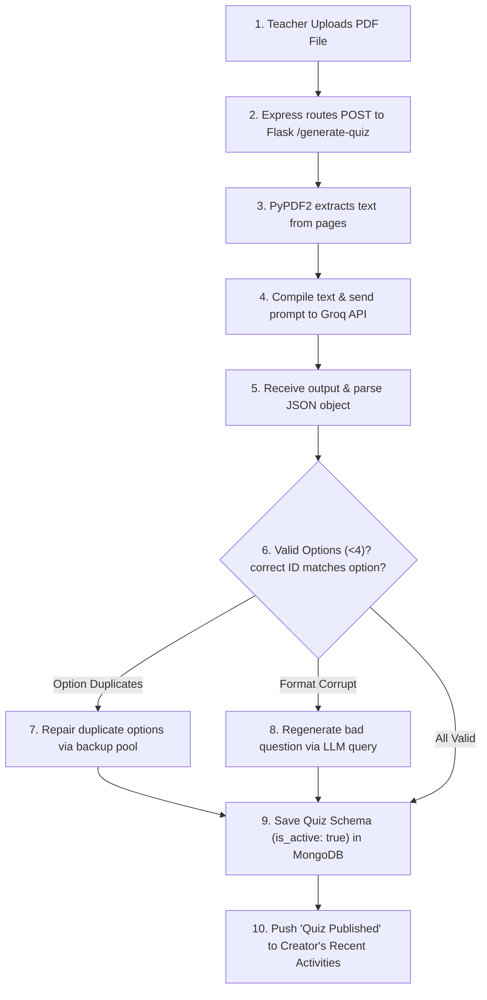
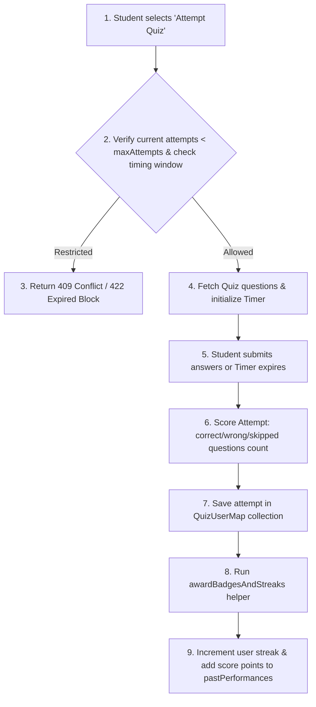
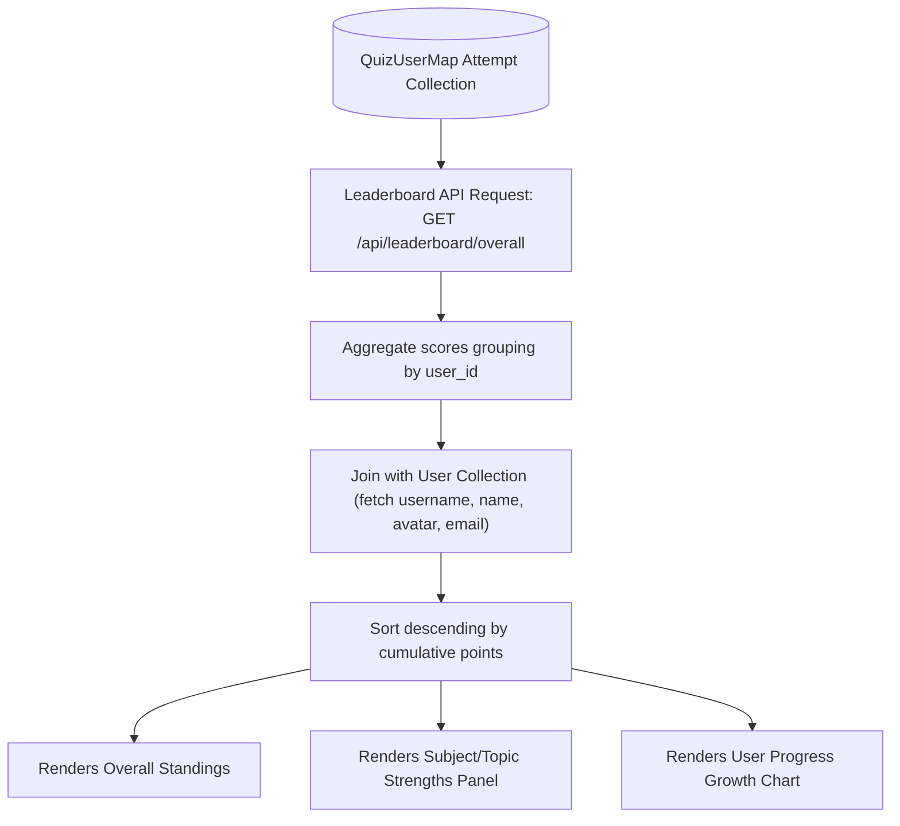
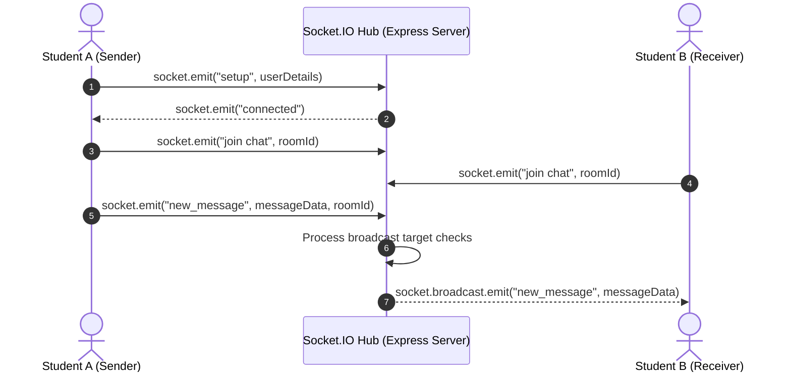
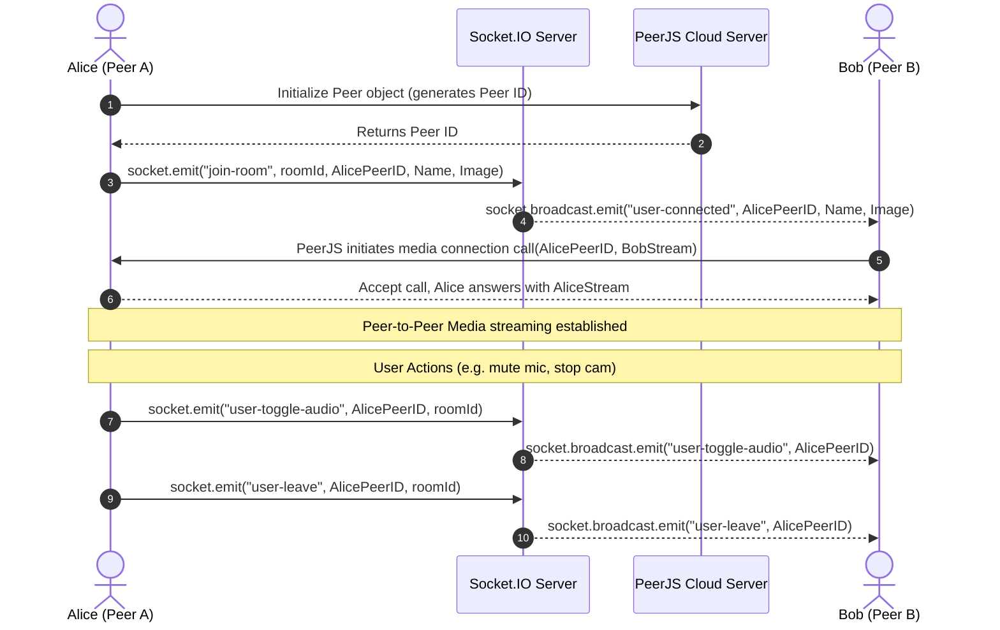

# Application Workflows & Lifecycles

This document details the step-by-step program flows and lifecycle stages for StudySphere's primary features.

---

## 1. AI Quiz Generation Flow (Level 8)

This workflow outlines how a teacher's uploaded PDF is parsed, processed by Llama-3.3-70b-versatile, validated, corrected, and finally stored as an active assessment.

---

## 2. Quiz Attempt Lifecycle (Level 9)

Details the flow from a student launching an assessment, the real-time execution parameters, score computation, and statistical updates.

---

## 3. Leaderboard Aggregation Flow (Level 10)

Explains how historical and current quiz attempts are aggregated to render the real-time leaderboard standings.

---

## 4. Socket.IO Chat Synchronization (Level 11)

This flow illustrates the real-time messaging cycle between active students within a channel.

---

## 5. WebRTC Video Calling & Signaling (Level 12)

Details the direct peer-to-peer audio, video, and screen-sharing setup using Socket.IO as the signaling plane and PeerJS.

